# 🍳 Smart Recipe - AI 냉장고 레시피 추천

> 냉장고 사진 한 장으로 맛있는 요리 레시피를 자동으로 추천받으세요!


## 📝 프로젝트 소개

**Smart Recipe**는 AI 기반 스마트 레시피 추천 웹 애플리케이션입니다. 냉장고나 식재료 사진을 업로드하면 AI가 자동으로 재료를 인식하고, 해당 재료로 만들 수 있는 맞춤형 레시피를 추천해줍니다.

### ✨ 주요 기능

| 기능 | 설명 |
|------|------|
| 🖼️ **재료 인식** | 냉장고/식재료 사진에서 AI가 자동으로 재료를 인식 |
| 🍽️ **레시피 생성** | 인식된 재료와 사용자 선호도에 맞는 레시피 추천 |
| 👤 **사용자 관리** | 회원가입, 로그인, 프로필 관리 |
| 💾 **레시피 저장** | 마음에 드는 레시피를 저장하고 관리 |
| 📊 **히스토리** | 분석 기록 및 저장된 레시피 조회 |

---

## 🏗️ 프로젝트 구조

```
recipe/
├── app.py                  # Flask 백엔드 (모든 API 엔드포인트)
├── requirements.txt        # Python 의존성
├── .gitignore             # Git 제외 파일
├── CLAUDE.md              # Claude Code 가이드
├── PRD_step1.md           # 이미지 재료 인식 기능 명세
├── PRD_step2.md           # AI 레시피 생성 기능 명세
├── PRD_step3.md           # 사용자 프로필/저장 기능 명세
├── health_check.py        # 서버 상태 확인
├── test_api.py            # API 통합 테스트
├── test_step1.py          # Step 1 테스트
├── test_step2.py          # Step 2 테스트
├── test_step3.py          # Step 3 테스트
├── templates/
│   └── index.html         # 메인 SPA 페이지
└── static/
    ├── css/style.css      # 스타일시트
    └── js/app.js          # 프론트엔드 로직
```

---

## 🛠️ 기술 스택

### Backend
- **Python 3.8+**
- **Flask** - 웹 프레임워크
- **SQLite** - 데이터베이스

### Frontend
- **HTML5 / CSS3 / JavaScript**
- Vanilla JS (프레임워크 없이 순수 JS)

### AI / API
- **OpenRouter API**
  - `google/gemma-3-27b-it:free` - 이미지 분석 (1순위)
  - `google/gemma-3-12b-it:free` - 이미지 분석 (2순위)
  - `deepseek/deepseek-r1-0528:free` - 텍스트 생성

---

## 🚀 시작하기

### 1. 저장소 클론

```bash
git clone https://github.com/sechan9999/recipe.git
cd recipe
```

### 2. 의존성 설치

```bash
pip install -r requirements.txt
```

### 3. 환경 변수 설정

`.env` 파일을 생성하고 다음 내용을 추가합니다:

```env
OPENROUTER_API_KEY=your_openrouter_api_key_here
SECRET_KEY=your_secret_key_here  # 선택사항, 자동 생성됨
```

> 💡 **OpenRouter API Key**는 [OpenRouter](https://openrouter.ai/)에서 무료로 발급받을 수 있습니다.

### 4. 서버 실행

```bash
python app.py
```

서버가 `http://localhost:5000`에서 실행됩니다.

---

## 📡 API 엔드포인트

### 이미지 분석 (Step 1)
| Endpoint | Method | Description |
|----------|--------|-------------|
| `/api/analyze` | POST | 이미지에서 식재료 인식 |

### 레시피 생성 (Step 2)
| Endpoint | Method | Description |
|----------|--------|-------------|
| `/api/recipe` | POST | AI 레시피 생성 |

### 사용자 인증 (Step 3)
| Endpoint | Method | Description |
|----------|--------|-------------|
| `/api/auth/register` | POST | 회원가입 |
| `/api/auth/login` | POST | 로그인 |
| `/api/auth/logout` | POST | 로그아웃 |

### 레시피 관리 (Step 3)
| Endpoint | Method | Description |
|----------|--------|-------------|
| `/api/recipes/save` | POST | 레시피 저장 |
| `/api/recipes` | GET | 저장된 레시피 목록 |
| `/api/recipes/<id>` | GET | 레시피 상세 조회 |
| `/api/recipes/<id>` | PUT | 레시피 수정 |
| `/api/recipes/<id>` | DELETE | 레시피 삭제 |

### 프로필 관리
| Endpoint | Method | Description |
|----------|--------|-------------|
| `/api/profile` | GET | 프로필 조회 |
| `/api/profile` | PUT | 프로필 수정 |
| `/api/profile/preferences` | GET | 선호도 조회 |
| `/api/profile/preferences` | PUT | 선호도 수정 |

---

## 🧪 테스트

각 단계별 테스트를 실행할 수 있습니다:

```bash
# Step 1: 이미지 재료 인식 테스트
python test_step1.py

# Step 2: 레시피 생성 테스트
python test_step2.py

# Step 3: 사용자 인증/저장 테스트
python test_step3.py

# 전체 API 테스트
python test_api.py
```

---

## 🔄 사용 흐름

```mermaid
flowchart LR
    A[📷 냉장고 사진 업로드] --> B[🤖 AI 재료 인식]
    B --> C[✏️ 재료 확인/수정]
    C --> D[⚙️ 옵션 선택]
    D --> E[🍳 AI 레시피 생성]
    E --> F[💾 레시피 저장]
```



### Step 1: 냉장고 분석
1. 냉장고 또는 식재료 사진 업로드 (드래그 앤 드롭 또는 파일 선택)
2. AI가 이미지를 분석하여 재료 자동 인식
3. 인식된 재료 목록 확인 및 수정/추가/삭제

### Step 2: 레시피 생성
1. 요리 옵션 선택 (종류, 난이도, 조리시간, 인원)
2. AI가 맞춤형 레시피 생성
3. 상세 조리법 및 팁 확인

### Step 3: 저장 및 관리
1. 회원가입/로그인
2. 마음에 드는 레시피 저장
3. 저장된 레시피 목록 관리

---

## 🗄️ 데이터베이스 스키마

### Users
- `id`, `email`, `password_hash`, `nickname`, `created_at`, `updated_at`

### User Preferences
- `id`, `user_id`, `allergies`, `dietary_restrictions`, `preferred_cuisines`

### Saved Recipes
- `id`, `user_id`, `recipe_name`, `recipe_data`, `ingredients`, `cuisine_type`, `difficulty`, `cook_time`, `rating`, `notes`, `tags`

### Analysis History
- `id`, `user_id`, `detected_ingredients`, `created_at`

---

## ⚠️ 주의사항

- **API Rate Limit**: 무료 OpenRouter API 사용 시 요청 제한이 있을 수 있습니다
- **이미지 크기**: 최대 10MB까지 지원
- **지원 형식**: JPG, PNG, WebP

---

## 📋 PRD 문서

자세한 기능 명세는 PRD 문서를 참고하세요:

- [PRD Step 1](./PRD_step1.md) - 냉장고 이미지 재료 인식
- [PRD Step 2](./PRD_step2.md) - AI 레시피 생성
- [PRD Step 3](./PRD_step3.md) - 사용자 프로필 및 레시피 저장

---

## 🤝 기여하기

1. Fork the Project
2. Create your Feature Branch (`git checkout -b feature/AmazingFeature`)
3. Commit your Changes (`git commit -m 'Add some AmazingFeature'`)
4. Push to the Branch (`git push origin feature/AmazingFeature`)
5. Open a Pull Request

---

## 📄 라이선스

이 프로젝트는 MIT 라이선스 하에 배포됩니다.

---

## 📞 문의

- **GitHub**: [@sechan9999](https://github.com/sechan9999)

---

<p align="center">
  Made with ❤️ by Smart Recipe Team
</p>
